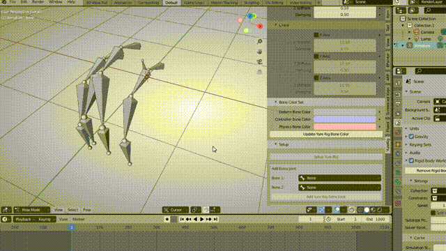
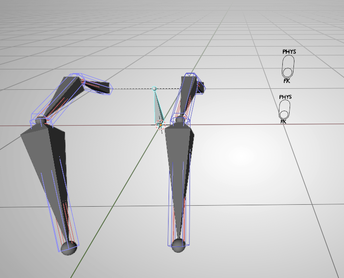
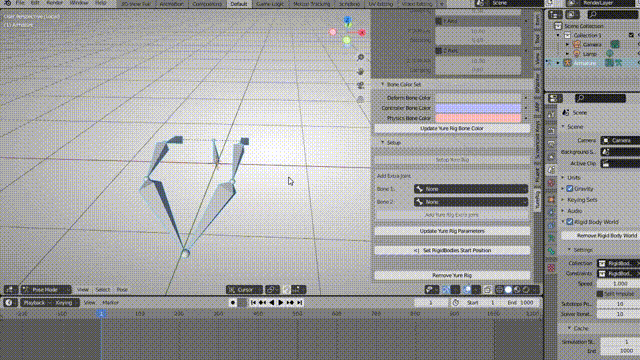
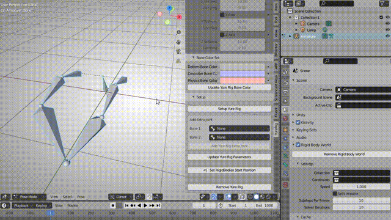
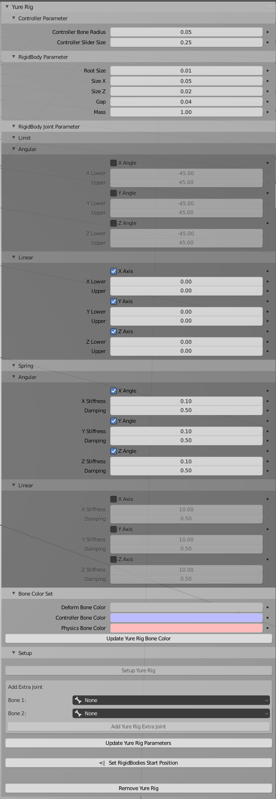

# YureRig-Blender

揺れもの用Rigのセットアップを行うアドオンです。

FK/Physics切り替えのスライダーがあることが特徴です。

質問・要望は[Discussions](https://github.com/MatchaChoco010/YureRig-Blender/discussions)か[私のTwitter](https://twitter.com/MatchaChoco010)までお願いします。

## 使い方

ボーン名に「_」が含まれていると正しく動作しません。
利用する場合はボーンの命名を注意してください。

### 基本的な使い方

Poseモードで揺らしたいボーンを選択し、それらの親となるボーンをアクティブにした状態で、YureRigパネルの「Setup Yure Rig」ボタンをクリックします。

FK/PHYSのスライダーをPHYSに設定して再生をすると物理演算で揺れます。

再生開始時のポーズを変えた際は「<|   Set RigidBodies Start Position」ボタンでRigidBodyの状態をリセットします。

揺れ方がおかしい場合は「Scene > RigidBodyWorld > Cache > Delete All Bakes」からベイクされたRigidBodyを削除してください。

### 複数リグの追加

物理とFKの切り替えを揺れ物事に切り替えたい場合、複数回「Setup Yure Rig」を実行してください。
「Setup Yure Rig」を実行するたびに、対応したスライダーが増えます。

### ジョイントの追加

「Add Extra Joint」からジョイントの追加を行えます。

ジョイントを追加したいボーンの組み合わせを選択して「Add Yure Rig Extra Joint」ボタンを押します。

### リグの破棄

「Remove Yure Rig」ボタンでリグを破棄できます。

### パラメータ

コントローラのサイズ、RigidBodyのパラメータ、RigidBodyのJointのパラメータが設定できます。
「Setup Yure Rig」ボタンクリック時に設定されたパラメータで生成されます。
特定のCTRLボーンを選択した状態で「Update Yure Rig Parameters」ボタンをクリックすると、そのボーンとそのボーンに紐付いたJointのパラメータがアップデートされます。

### ボーンの色変更

ボーンの色がボーングループに割り当てられています。
「Update Yure Rig Bone Color」をクリックすることで、Poseモードでのボーンの色を変更できます。
